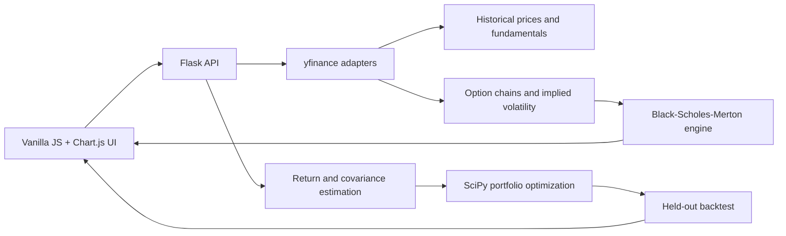

# Portfolio Optimizer & Options Analytics

[](https://github.com/TBBJason/CAPM-Portfolio-Optimizing/actions/workflows/tests.yml)
[](https://www.python.org/)
[](https://capm-sga6.onrender.com/)

A full-stack quantitative finance application that builds a maximum-Sharpe portfolio, visualizes the efficient frontier, evaluates it on a held-out year of market data, and enriches live option chains with Black–Scholes–Merton prices and Greeks.

**[Open the live application](https://capm-sga6.onrender.com/)** · Try `AAPL`, `MSFT`, and `GOOG` with the default settings. The Render free tier may take about a minute to wake from an idle state.

> This project implements historical mean-variance optimization (Modern Portfolio Theory). Despite the repository's original CAPM-oriented name, expected returns are historical sample means rather than CAPM beta-derived estimates.

## What this project demonstrates

- **Quantitative implementation:** closed-form and constrained tangency portfolios, target-return efficient-frontier optimization, constant-correlation Ledoit–Wolf covariance shrinkage, and Black–Scholes–Merton pricing and Greeks.
- **Careful data handling:** adjusted market prices, labels aligned to provider-returned columns, invalid-symbol reporting, and a one-year train/test holdout to avoid presenting in-sample performance as a backtest.
- **Full-stack delivery:** a Flask JSON API, responsive vanilla JavaScript interface, interactive Chart.js visualizations, and a gunicorn deployment on Render.
- **Deterministic quality checks:** unit tests for numerical routines and provider adapters plus Flask integration tests, all isolated from live network calls.

## Features

- Maximum-Sharpe portfolio optimization with long-only or short-selling modes
- Efficient frontier, asset risk/return points, tangency portfolio, and capital market line
- Optional Ledoit–Wolf covariance shrinkage, enabled by default
- One-year out-of-sample cumulative portfolio backtest
- Company fundamentals including market cap, P/E, revenue, price, and beta
- Live option expirations and chains from `yfinance`
- Black–Scholes–Merton theoretical value, delta, gamma, vega, theta, and rho per contract
- Input guardrails, dropped-symbol warnings, CORS handling, and a health endpoint

## Architecture



The network-facing adapters are kept separate from deterministic numerical code. This makes the optimizer, estimator, backtest, and option-pricing logic testable without depending on Yahoo Finance availability.

### Optimization flow

1. Normalize and de-duplicate 2–10 ticker symbols.
2. Download adjusted closing prices for the requested lookback plus a one-year holdout.
3. Estimate annualized arithmetic returns and either sample covariance or Ledoit–Wolf shrunk covariance from the training window.
4. Solve for maximum-Sharpe weights and the minimum-variance frontier.
5. Apply the fixed target weights to daily returns in the held-out window and return portfolio analytics to the UI.

## Methodology

| Area | Implementation |
|---|---|
| Expected returns | Arithmetic mean of daily returns, annualized with 252 trading days |
| Risk model | Sample covariance or constant-correlation Ledoit–Wolf shrinkage |
| Portfolio objective | Maximum Sharpe ratio relative to the supplied risk-free rate |
| Constraints | Fully invested; long-only by default, optional unrestricted shorting |
| Frontier | SLSQP minimum-variance solve across target returns |
| Backtest | Most recent year held out from estimation; fixed weights applied to daily returns |
| Option model | European Black–Scholes–Merton using provider implied volatility |
| Greek units | Delta/gamma per $1; vega/rho per 1 percentage point; theta per calendar day |

## Tech stack

- **Backend:** Python 3.11, Flask, gunicorn
- **Quantitative computing:** NumPy, pandas, SciPy
- **Market data:** `yfinance`
- **Frontend:** HTML, CSS, vanilla JavaScript, Chart.js 4.5.1
- **Testing and automation:** pytest, Flask test client, GitHub Actions, Dependabot
- **Hosting:** Render-compatible `Procfile`

## Run locally

### Prerequisites

- Python 3.11
- Internet access for live Yahoo Finance data

```bash
git clone https://github.com/TBBJason/CAPM-Portfolio-Optimizing.git
cd CAPM-Portfolio-Optimizing
python3.11 -m venv .venv
source .venv/bin/activate          # Windows: .venv\Scripts\activate
python -m pip install -r requirements-dev.txt
python backend.py
```

Open [http://localhost:10000](http://localhost:10000). Set `PORT` to override the default port.

Confirm the backend is healthy:

```bash
curl http://localhost:10000/api/health
```

## API overview

All data endpoints accept and return JSON. Their `GET` handlers provide a short status message; use `POST` for calculations.

| Endpoint | Purpose | Important inputs |
|---|---|---|
| `POST /api/optimize` | Weights, metrics, backtest, and frontier | `tickers`, `rf`, `lookback_years`, `allow_shorting`, `use_shrinkage` |
| `POST /api/frontier` | Frontier, tangency point, and asset points | Same shape as `/api/optimize` |
| `POST /api/fundamentals` | Company profile and valuation metrics | `tickers` |
| `POST /api/options/expirations` | Available expiration dates and spot price | `ticker` |
| `POST /api/options/chain` | Calls and puts enriched with model values and Greeks | `ticker`, `expiry`, `rf`, `dividend_yield` |
| `GET /api/health` | Deployment liveness check | None |

### Optimize a portfolio

```bash
curl -X POST http://localhost:10000/api/optimize \
  -H 'Content-Type: application/json' \
  -d '{
    "tickers": ["AAPL", "MSFT", "GOOG"],
    "rf": 0.04,
    "lookback_years": 3,
    "allow_shorting": false,
    "use_shrinkage": true
  }'
```

A successful response includes labeled `weights`, annualized `expected_return` and `volatility`, `sharpe`, `shrinkage_intensity`, `backtest_values`, and the efficient-frontier payload. If a requested symbol has no usable data, the response also includes a `warning` identifying it.

### Fetch fundamentals

```bash
curl -X POST http://localhost:10000/api/fundamentals \
  -H 'Content-Type: application/json' \
  -d '{"tickers": ["AAPL", "MSFT"]}'
```

### Fetch an option chain

First request valid dates from `/api/options/expirations`, then pass one to `/api/options/chain`:

```json
{
  "ticker": "AAPL",
  "expiry": "YYYY-MM-DD",
  "rf": 0.04,
  "dividend_yield": 0.0
}
```

The chain response includes quote fields, implied volatility, `bs_price`, and all five Greeks. Expired contracts and records with non-positive implied volatility receive `null` model values; if the underlying spot price cannot be determined, the API returns a client error.

## Project structure

| Path | Responsibility |
|---|---|
| `backend.py` | Flask routes, validation, data orchestration, and response shaping |
| `portfolio.py` | Tangency portfolios and efficient-frontier optimization |
| `main.py` | Market-data adapter, statistics, fundamentals, and covariance shrinkage |
| `options.py` | Option-chain adapter and Black–Scholes–Merton analytics |
| `backtest.py` | Cumulative portfolio-value calculation |
| `index.html` | Responsive single-page frontend and charts |
| `test_api.py` | Flask integration tests with synthetic market data |
| `test_portfolio.py` | Portfolio optimizer unit tests |
| `test_estimators.py` | Covariance-estimator numerical invariants |
| `test_options.py` | Option pricing, Greeks, and option-provider workflow tests |
| `test_main.py` | Market-data, statistics, and fundamentals adapter tests |
| `test_backtest.py` | Exact backtest compounding and download behavior tests |
| `.github/workflows/tests.yml` | Automated test suite for pushes and pull requests |
| `Procfile` | Production gunicorn command |

## Testing

```bash
python -m pytest -q
```

The suite checks hand-calculated portfolio cases, optimizer constraints, covariance symmetry and positive semidefiniteness, shrinkage behavior, textbook option values, put-call parity, finite-difference Greeks, exact backtest compounding, provider fallbacks, API validation, CORS, and response contracts. External market calls are mocked so the default suite is deterministic and fast.

GitHub Actions runs the same suite on every pull request and push to `main`. Dependabot checks Python and GitHub Actions dependencies monthly.

## Deployment

The included `Procfile` starts `gunicorn backend:app` and binds to the platform-provided `PORT`. The public deployment is hosted on Render and exposes `/api/health` for liveness checks.

## Limitations and assumptions

- Historical arithmetic means are noisy forecasts; covariance shrinkage improves conditioning but does not remove estimation risk.
- The backtest assumes fixed target weights applied to daily returns and excludes fees, slippage, taxes, liquidity constraints, and a benchmark.
- Enabling short selling removes weight bounds, so the mathematical solution can imply leverage that may not be practical.
- `yfinance` is an unofficial external data source; symbols, fields, rate limits, and availability can change.
- Black–Scholes–Merton is a European-option model. US-listed equity options are generally American-style, and the UI currently uses a zero dividend yield, so model values are analytical estimates rather than executable prices.
- This project is for education and demonstration only—not investment advice. Past performance does not predict future results.
